# Sprint 1 — Registration + Catalog / Search

**Sprint Duration:** October 5–10  
**Sprint Goal:** Develop customer account features and product catalog/search functionality.  
**Product Owner:** Sayeda Taiba Agha

### Team Responsibilities

| Team Member | Responsibility |
|---|---|
| **Faeza Ahmadi** | Frontend Tasks |
| **Salma Rahman** | Backend Tasks |

---

## Sprint 1 Planning

```mermaid
flowchart LR

%% ================= REGISTRATION =================

REG["EPIC: REGISTRATION"]

REG --> US1["US-01: Customer Registration<br/>Create a customer account using<br/>name, email, and password"]

REG --> US2["US-02: Customer Login<br/>Sign in using registered<br/>account details"]

REG --> US3["US-03: Customer Logout<br/>Securely log out after<br/>finishing activity"]

US1 --> R1["Design registration form<br/>Faeza Ahmadi"]
US1 --> R2["Validate registration fields<br/>Faeza Ahmadi"]
US1 --> R3["Create registration backend logic<br/>Salma Rahman"]
US1 --> R4["Store account in PostgreSQL<br/>Salma Rahman"]
US1 --> R5["Connect registration form to API<br/>Faeza Ahmadi + Salma Rahman"]
US1 --> R6["Test registration"]

US2 --> L1["Design login form<br/>Faeza Ahmadi"]
US2 --> L2["Display invalid-login messages<br/>Faeza Ahmadi"]
US2 --> L3["Validate login credentials<br/>Salma Rahman"]
US2 --> L4["Implement authentication<br/>Salma Rahman"]
US2 --> L5["Connect login interface to API<br/>Faeza Ahmadi + Salma Rahman"]
US2 --> L6["Test login"]

US3 --> O1["Add logout control<br/>Faeza Ahmadi"]
US3 --> O2["End authenticated session<br/>Salma Rahman"]
US3 --> O3["Redirect after logout<br/>Faeza Ahmadi"]
US3 --> O4["Protect restricted pages<br/>Salma Rahman"]
US3 --> O5["Test logout"]


%% ================= CATALOG / SEARCH =================

CAT["EPIC: CATALOG / SEARCH"]

CAT --> US4["US-04: Product Catalog<br/>Browse available grocery products<br/>with price and availability"]

CAT --> US5["US-05: Product Details<br/>Open a product and view<br/>detailed information"]

CAT --> US6["US-06: Product Search<br/>Find products using<br/>name or keyword"]

CAT --> US7["US-07: Product Filtering<br/>Filter products by category<br/>or availability"]

CAT --> US8["US-08: Product Sorting<br/>Sort displayed products<br/>using criteria such as price"]

US4 --> C1["Build catalog interface<br/>Faeza Ahmadi"]
US4 --> C2["Display product information<br/>Faeza Ahmadi"]
US4 --> C3["Create product/category models<br/>Salma Rahman"]
US4 --> C4["Retrieve products through API<br/>Salma Rahman"]
US4 --> C5["Handle loading / empty states<br/>Faeza Ahmadi"]
US4 --> C6["Test product catalog"]

US5 --> D1["Build product details page<br/>Faeza Ahmadi"]
US5 --> D2["Display detailed information<br/>Faeza Ahmadi"]
US5 --> D3["Retrieve product by ID<br/>Salma Rahman"]
US5 --> D4["Add Add-to-Cart entry point<br/>Faeza Ahmadi"]
US5 --> D5["Test product details"]

US6 --> S1["Add search input<br/>Faeza Ahmadi"]
US6 --> S2["Display search results<br/>Faeza Ahmadi"]
US6 --> S3["Implement search API/query<br/>Salma Rahman"]
US6 --> S4["Handle no-results state<br/>Faeza Ahmadi"]
US6 --> S5["Test product search"]

US7 --> F1["Build filter controls<br/>Faeza Ahmadi"]
US7 --> F2["Update displayed results<br/>Faeza Ahmadi"]
US7 --> F3["Connect filters to API/data<br/>Salma Rahman"]
US7 --> F4["Add clear/reset filters<br/>Faeza Ahmadi"]
US7 --> F5["Test filtering"]

US8 --> T1["Add sorting control<br/>Faeza Ahmadi"]
US8 --> T2["Update displayed product order<br/>Faeza Ahmadi"]
US8 --> T3["Implement sorting logic/API<br/>Salma Rahman"]
US8 --> T4["Preserve search/filter selections<br/>Faeza Ahmadi"]
US8 --> T5["Test sorting"]


%% ================= STYLING =================

classDef epic fill:#ffffff,color:#000000,stroke:#000000,stroke-width:2px;
classDef story fill:#ffffff,color:#000000,stroke:#000000,stroke-width:1.5px;
classDef task fill:#ffffff,color:#000000,stroke:#000000,stroke-width:1px;

class REG,CAT epic;
class US1,US2,US3,US4,US5,US6,US7,US8 story;
class R1,R2,R3,R4,R5,R6,L1,L2,L3,L4,L5,L6,O1,O2,O3,O4,O5,C1,C2,C3,C4,C5,C6,D1,D2,D3,D4,D5,S1,S2,S3,S4,S5,F1,F2,F3,F4,F5,T1,T2,T3,T4,T5 task;
```

