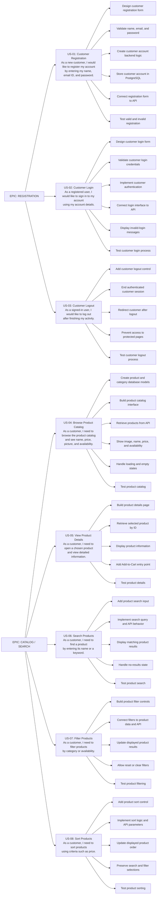

# Sprint 1 — Registration + Catalog / Search

**Sprint Duration:** October 5–10  
**Sprint Goal:** Develop the customer account features and product catalog/search functionality.

```mermaid
flowchart LR

    %% REGISTRATION
    REG["EPIC: REGISTRATION"]

    REG --> US1["US-01: Customer Registration<br/>As a new customer, I would like to register my account<br/>by entering my name, email ID, and password."]
    REG --> US2["US-02: Customer Login<br/>As a registered user, I would like to sign in to my account<br/>using my account details."]
    REG --> US3["US-03: Customer Logout<br/>As a signed-in user, I would like to log out<br/>after finishing my activity."]

    US1 --> R1["Design customer registration form"]
    US1 --> R2["Validate name, email, and password"]
    US1 --> R3["Create customer account backend logic"]
    US1 --> R4["Store customer account in PostgreSQL"]
    US1 --> R5["Connect registration form to API"]
    US1 --> R6["Test valid and invalid registration"]

    US2 --> L1["Design customer login form"]
    US2 --> L2["Validate customer login credentials"]
    US2 --> L3["Implement customer authentication"]
    US2 --> L4["Connect login interface to API"]
    US2 --> L5["Display invalid-login messages"]
    US2 --> L6["Test customer login process"]

    US3 --> O1["Add customer logout control"]
    US3 --> O2["End authenticated customer session"]
    US3 --> O3["Redirect customer after logout"]
    US3 --> O4["Prevent access to protected pages"]
    US3 --> O5["Test customer logout process"]


    %% CATALOG / SEARCH
    CAT["EPIC: CATALOG / SEARCH"]

    CAT --> US4["US-04: Browse Product Catalog<br/>As a customer, I need to browse the product catalog<br/>and see name, price, picture, and availability."]

    CAT --> US5["US-05: View Product Details<br/>As a customer, I need to open a chosen product<br/>and view detailed information."]

    CAT --> US6["US-06: Search Products<br/>As a customer, I need to find a product<br/>by entering its name or a keyword."]

    CAT --> US7["US-07: Filter Products<br/>As a customer, I need to filter products<br/>by category or availability."]

    CAT --> US8["US-08: Sort Products<br/>As a customer, I need to sort products<br/>using criteria such as price."]

    US4 --> C1["Create product and category database models"]
    US4 --> C2["Build product catalog interface"]
    US4 --> C3["Retrieve products from API"]
    US4 --> C4["Show image, name, price, and availability"]
    US4 --> C5["Handle loading and empty states"]
    US4 --> C6["Test product catalog"]

    US5 --> D1["Build product details page"]
    US5 --> D2["Retrieve selected product by ID"]
    US5 --> D3["Display product information"]
    US5 --> D4["Add Add-to-Cart entry point"]
    US5 --> D5["Test product details"]

    US6 --> S1["Add product search input"]
    US6 --> S2["Implement search query and API behavior"]
    US6 --> S3["Display matching product results"]
    US6 --> S4["Handle no-results state"]
    US6 --> S5["Test product search"]

    US7 --> F1["Build product filter controls"]
    US7 --> F2["Connect filters to product data and API"]
    US7 --> F3["Update displayed product results"]
    US7 --> F4["Allow reset or clear filters"]
    US7 --> F5["Test product filtering"]

    US8 --> T1["Add product sort control"]
    US8 --> T2["Implement sort logic and API parameters"]
    US8 --> T3["Update displayed product order"]
    US8 --> T4["Preserve search and filter selections"]
    US8 --> T5["Test product sorting"]
```
